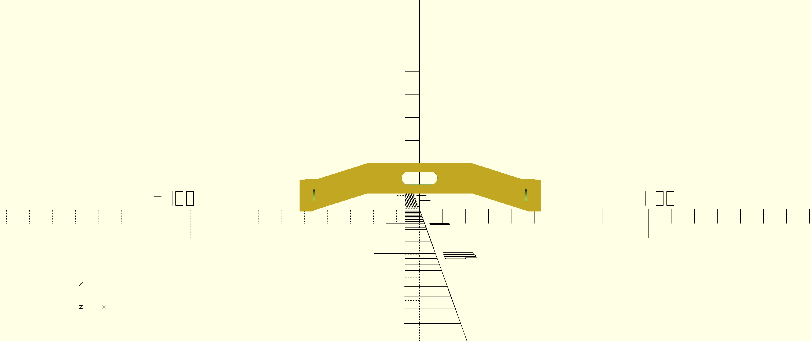
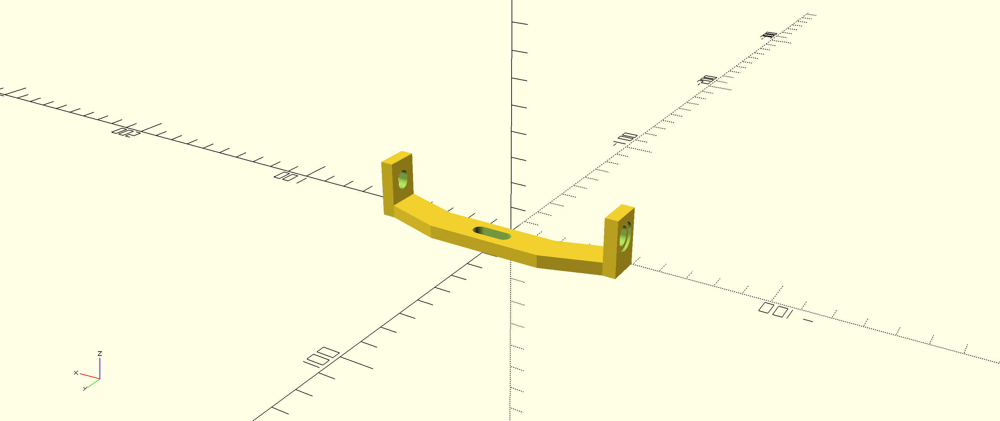

This is an OpenSCAD project to create a model for a bracket to mount fenders on a Canyon Grizl

The bracket mounts on the upper end of the seat stays.

### ToDo:
* ~~add screw hole recess~~
* ~~set correct screw diameter~~
* ~~add scaling factor~~
* ~~refactor to center on origin~~
* add chamfer?